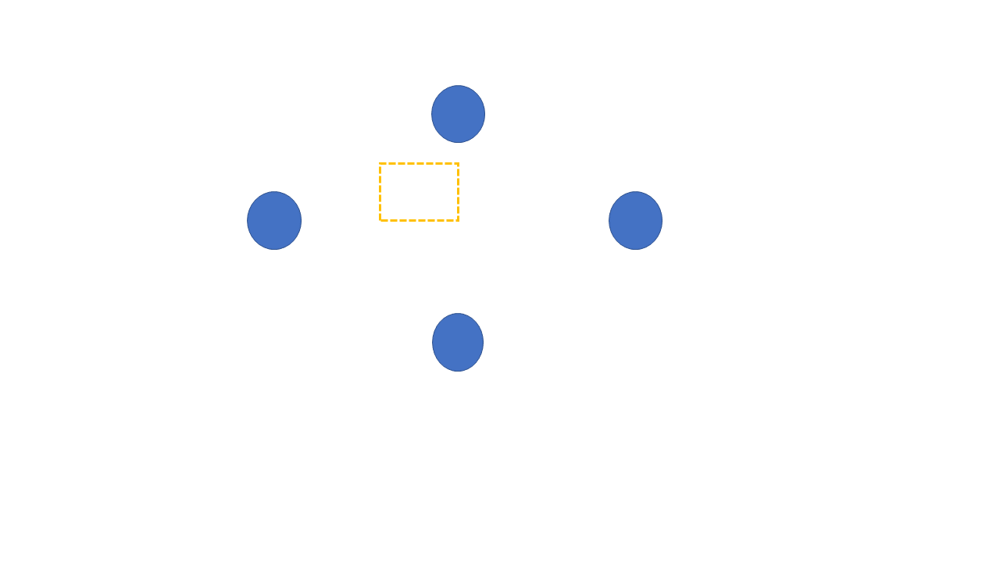
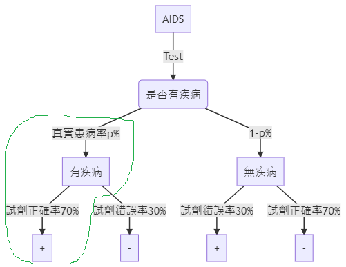
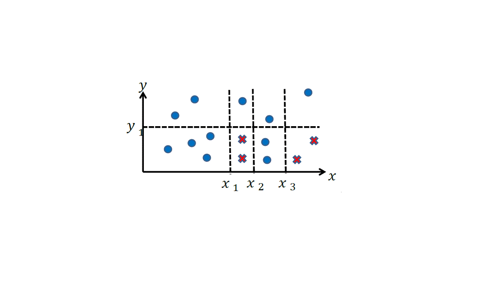
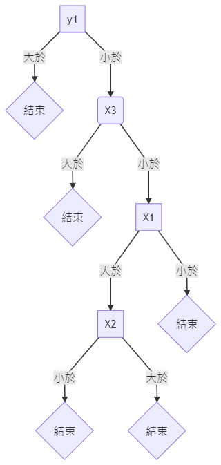

# Q1. Prove that a rectangle decision function has a VC dimension of 4 by enumerating all possible sample distributions. You can reasonably assume no two (or more) samples are on the same vertical or horizontal line. 通過枚舉所有可能的樣本分佈，證明矩形決策函數的 VC dimension 為 4。您可以合理地假設在同一垂直或水平線上沒有兩個（或更多）樣本。

<h2 style="color:#998625; font-weight:900;">ANS</h2>

>  <h3 style="color:blue; font-weight:900;">1. Proof</h3>

> > ### VC-dimension is at lest 4 by showing that there exits a 4-point set shattered by the concept set.
> >
> > ## $d_{VC}=BreakPoint−1 \Rightarrow d_{VC}=4−1=3$



---

# Q2. We mention the AIDS detection problem in Bayesian decision theory. Use Bayes theorem to confirm the given answer. To answer this problem, you need to distinguish two different conditions: 我們在 Bayesian 決策理論中提到了 AIDS 檢測問題。 使用 Bayesian 定理來確認給定的答案。 要解決此問題，您需要區分兩個不同的條件：

>  <h3 style="color:blue; font-weight:900;">1. Proof</h3>

> > -   ### 一準確度為 70%的試劑盒，可以驗出是否罹患 AIDS（陽性+)。
> >     > ### 試劑正確率 70%，試劑錯誤率 70%。
> > -   ### 假設真實得病率 P(+)=1%
> >     > ### 偽陰性: P(-)/疾病
> >     >
> >     > ### 偽陽性: P(+)/無疾病
> >     >
> >     > ### P(-)/疾病 = P(+)/無疾病

|          |                 |         受檢者          |                         |
| -------- | --------------- | :---------------------: | :---------------------: |
|          |                 |  不帶原 (non-carrier)   |   帶原 (true-carrier)   |
| 採檢結果 | 陽性 (positive) | 偽陽性 (false positive) | 真陽性 (true positive)  |
|          | 陰性 (negative) | 真陰性 (true negative)  | 偽陰性 (false negative) |

-   ### Q2-1.False positive is a conditional probability P(reagent is negative | patient is infected). Same argument for false negative. 假陽性是條件概率 P（試劑陰性|患者被感染）。 假陰性的參數相同。
    >  <h3 style="color:blue; font-weight:900;">2.1 </h3>

$\bf{P(被感染|陽性)=\frac{P(陽性|被感染)P(被感染)}{P(陽性)}}$



-   ### Q2-2.When a patient is given a positive test result, it is actually P(patient is infected | reagent is positive)當患者的檢測結果為陽性時，是真實的 P（患者被感染|試劑為陽性）
    >  <h3 style="color:blue; font-weight:900;">2.2 </h3>

$\bf{P(被感染|陽性)=\frac{P(陽性|被感染)P(被感染)}{P(陽性)}}$


---

# Q3. We mention an example to use Naïve Bayesian classifier for classifying colored squares and circles in the lecture. Following the example, which class will a red circle be assigned to? 我們在講課中提到了一個使用 Naïve Bayesian 分類器對彩色正方形和圓形進行分類的示例。 在此示例之後，將為哪個類別分配一個紅色圓圈<font style="color:red">●</font>？

<h2 style="color:#998625; font-weight:900;">ANS</h2>

---

# Q4. Plot a decision tree for the following data points. If you carefully design your tree, you will just need to use one or in a vertex.繪製以下數據點的決策樹。 如果您精心設計你的決策樹，則只需要使用一個或一個頂點即可。

<h2 style="color:#998625; font-weight:900;">ANS</h2>





---

# Q5. We mentioned the gamblers ruin chain in the lecture. If the gambler decides to bet a different amount of money on each bet, which of the following is a better strategy to survive longer assuming the gambler has a finite amount of money 我們在課堂中提到了賭徒的毀滅之鍊。如果賭徒決定對每個賭注下注不同數量的錢，那麼假設賭徒的錢數量有限，以下哪一項是更長久的更好策略。

## Q5-1.Bet more money next time if he/she won last time, and bet less money next time if he/she lost last time 如果他/她上次贏了，下一次賭更多的錢，如果他/她最後一次輸了，那麼下一次賭更少的錢

<h2 style="color:#998625; font-weight:900;">ANS</h2>

>  <h3 style="color:blue; font-weight:900;">1. 遊戲規則</h3>

> > #### 玩家和莊家同時擲兩個骰子，由點數和比大小，玩家只能選擇大或小，猜錯或是和局皆算莊家贏。

|      | 本金  | 賭資 | 贏局加碼率 | 輸局減碼率 | 贏局下次賭資  | 輸局下次賭資  |
| :--: | :---: | :--: | :--------: | :--------: | :-----------: | :-----------: |
| 玩家 | 10000 |  10  |   0.0002   |   0.0001   | 1.0002 倍賭資 | 0.9999 倍賭資 |

>  <h3 style="color:blue; font-weight:900;">2. 程式碼說明</h3>

* #### 封裝遊戲和人物
```python

class DiceGame:
    def __init__(self, dice, sides, rolls):
        self.dice = dice    # 骰子數
        self.sides = sides  # 幾面
        self.rolls = rolls  #幾局
     

    def oneRoll(self):
        total = [random.randint(1, self.sides) for i in range(self.dice) ]
        return sum(total)
    
    def gameResult(self, guess, presult, oresult):
        if guess==0 and (oresult>presult):
            return True
        elif guess==1 and (oresult<presult):
            return True
        else:
            return False
    
    def roll(self):
        d = defaultdict(int)
        for _ in range(self.rolls):
            d[sum(random.randint(1, self.sides) for _ in range(self.dice))] += 1
        return d

class GamePlayer: 
    def __init__(self): 
        self.deposit = 10000 # 1萬存款
        
        
    def startRollDice(self, objfun):
        return objfun()
```
* #### 實例化遊戲和人物
```python
dice = DiceGame(2,6,1) 
player=GamePlayer()  # 玩家
owner=GamePlayer()   # 莊家
```
* #### 執行遊戲
```python
log_df = pd.DataFrame() # 記錄每局遊戲狀況
count = 0
basebet = 10
winRate=1.0002   # 贏的下次投注率
loseRate=0.9999  # 輸的下次投注率
while player.deposit >0:
    if count==0:
        gameresultDict = {
            'result' : '尚未開局' ,
            'count' : int(count) ,
            'money' : player.deposit ,
            'bet' : basebet ,
        }
        log_df=log_df.append(gameresultDict , ignore_index=True)
    
    count +=1    
    guess = random.randint(0, 1) # 猜大小，0為小，1為大
    ownerResult = owner.startRollDice(dice.oneRoll)
    playerResult = player.startRollDice(dice.oneRoll)
    gameresult = dice.gameResult(guess=guess, presult=playerResult, oresult=ownerResult)
    
    
    
    if gameresult:
        # win
        
        if count==1:
            # 首局
            player.deposit += basebet # 本金異動
            basebet *=winRate               #下次賭資異動
        else:
            
            player.deposit += basebet  # 本金異動    
            basebet *=winRate                #下次賭資異動
        
        
        gameresultDict = {
            'result' : 'Win' if gameresult else 'Lose' ,
            'count' : int(count) ,
            'money' : player.deposit ,
            'bet' : basebet ,
        }
        log_df=log_df.append(gameresultDict , ignore_index=True)
        print('第{}局狀況:{}。目前本金:{}。目前賭資:{}'.format(count,'== Win ==',player.deposit,basebet))
        
    else:
        # lose
        
        if count==1:
            player.deposit -= basebet # 本金異動
            basebet *=loseRate               #下次賭資異動
        else:
            player.deposit -= basebet # 本金異動
            basebet *=loseRate               #下次賭資異動
            
        gameresultDict = {
            'result' : 'Win' if gameresult else 'Lose' ,
            'count' : int(count) ,
            'money' : player.deposit ,
            'bet' : basebet ,
        }
        log_df=log_df.append(gameresultDict , ignore_index=True)
        
        print('第{}局狀況:{}。目前本金:{}。目前賭資:{}'.format(count,'== Lose ==',player.deposit,basebet))
    
```

>  <h3 style="color:blue; font-weight:900;">3. 結果</h3>
>
> > #### 最終，玩家還是破產收場，但輸贏比趨近 1:1。

>  <h3 style="color:blue; font-weight:900;">4. 圖示</h3>


<iframe src="line1.html" style="width:800px; height:650px;"> </iframe>
<iframe src="bet1.html" style="width:800px; height:650px;"> </iframe>
<iframe src="pie1.html" style="width:800px; height:650px;"> </iframe>


## Q5-2.Bet less money next time if he/she won last time , and bet more money next time if he/she lost last time. Hint: If you are unable to figure out the answer follows the concept of the Kelly Criterion. 如果他/她上次獲勝，則下一次下注更少，如果他/她上次輸了，則下一次下注更多。提示：如果您無法確定答案，則遵循凱利準則的概念。

<h2 style="color:#998625; font-weight:900;">ANS</h2>

>  <h3 style="color:blue; font-weight:900;">1. 遊戲規則</h3>

> > ### 玩家和莊家同時擲兩個骰子，由點數和比大小，玩家只能選擇大或小，猜錯或是和局皆算莊家贏。

|      | 本金  | 賭資 | 贏局減碼率 | 輸局加碼率 | 贏局下次賭資  | 輸局下次賭資  |
| :--: | :---: | :--: | :--------: | :--------: | :-----------: | :-----------: |
| 玩家 | 10000 |  10  |   0.0001   |   0.0002   | 0.9999 倍賭資 | 1.0002 倍賭資 |


>  <h3 style="color:blue; font-weight:900;">2. 程式碼說明</h3>

* #### 執行遊戲
```python
log_df = pd.DataFrame() # 記錄每局遊戲狀況
count = 0
basebet = 10
winRate=0.9999  # 贏的下次投注率
loseRate=1.0002 # 輸的下次投注率
while player.deposit >0:
    if count==0:
        gameresultDict = {
            'result' : '尚未開局' ,
            'count' : int(count) ,
            'money' : player.deposit ,
            'bet' : basebet ,
        }
        log_df=log_df.append(gameresultDict , ignore_index=True)
    
    count +=1    
    guess = random.randint(0, 1) # 猜大小，0為小，1為大
    ownerResult = owner.startRollDice(dice.oneRoll)
    playerResult = player.startRollDice(dice.oneRoll)
    gameresult = dice.gameResult(guess=guess, presult=playerResult, oresult=ownerResult)
    
    
    
    if gameresult:
        # win
        
        if count==1:
            # 首局
            player.deposit += basebet # 本金異動
            basebet *=winRate               #下次賭資異動
        else:
            
            player.deposit += basebet  # 本金異動    
            basebet *=winRate                #下次賭資異動
        
        
        gameresultDict = {
            'result' : 'Win' if gameresult else 'Lose' ,
            'count' : int(count) ,
            'money' : player.deposit ,
            'bet' : basebet ,
        }
        log_df=log_df.append(gameresultDict , ignore_index=True)
        print('第{}局狀況:{}。目前本金:{}。目前賭資:{}'.format(count,'== Win ==',player.deposit,basebet))
        
    else:
        # lose
        
        if count==1:
            player.deposit -= basebet # 本金異動
            basebet *=loseRate               #下次賭資異動
        else:
            player.deposit -= basebet # 本金異動
            basebet *=loseRate               #下次賭資異動
            
        gameresultDict = {
            'result' : 'Win' if gameresult else 'Lose' ,
            'count' : int(count) ,
            'money' : player.deposit ,
            'bet' : basebet ,
        }
        log_df=log_df.append(gameresultDict , ignore_index=True)
        
        print('第{}局狀況:{}。目前本金:{}。目前賭資:{}'.format(count,'== Lose ==',player.deposit,basebet))
```

>  <h3 style="color:blue; font-weight:900;">3. 結果</h3>

> > #### 最終，玩家還是破產收場，但輸贏比趨近 1:1。

>  <h3 style="color:blue; font-weight:900;">4. 圖示</h3>
> 
<iframe src="line2.html" style="width:800px; height:650px;"> </iframe>
<iframe src="bet2.html" style="width:800px; height:650px;"> </iframe>
<iframe src="pie2.html" style="width:800px; height:650px;"> </iframe>


<h3 style="color:blue; font-weight:900;">4. 結論</h3>
<h4 style="color:#333; font-weight:800; font-size:20px;">依照上述兩種玩法，不管用甚麼方式做加碼或減碼，玩家最終會破產，只是局數玩得多或是少而已。</h4>
